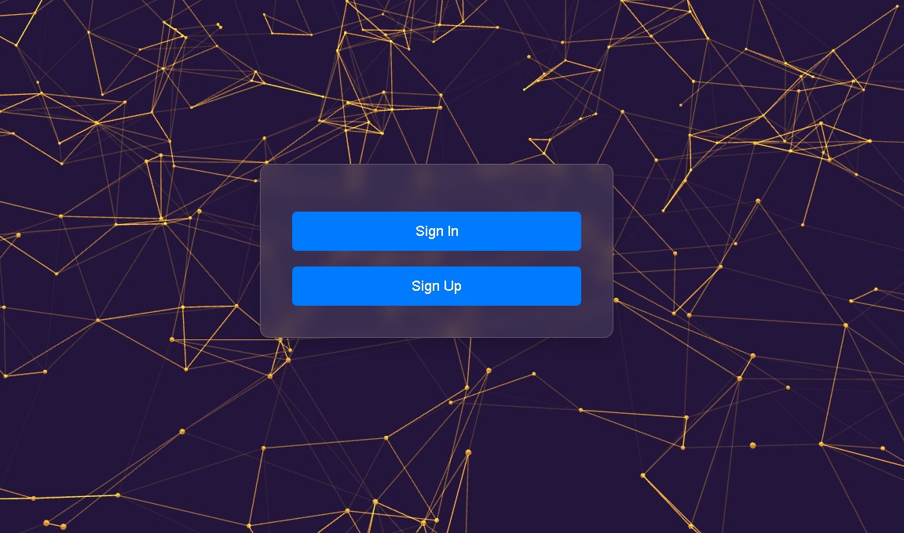

## 📝About
A lightweight authentication system with secure hashing, designed for simple side projects without requiring a database. 

## 👨‍💻 Dependencies
MAKE SURE THAT YOU HAVE THESE MODULES INSTALLED FIRST!
> flask 
> bcrypt 

## 📺 Updates
<h3>Will probably add database option as well </h3>

